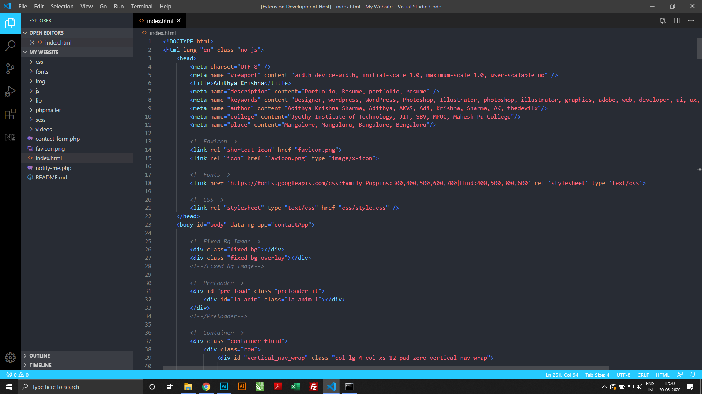

# Dragon Ball Anime Based Visual Studio Code Theme

This A Theme Based On The Anime, Dragon Ball Super!  

## Preview

### For more information
* [Visual Studio Code's Markdown Support](http://code.visualstudio.com/docs/languages/markdown)
* [Markdown Syntax Reference](https://help.github.com/articles/markdown-basics/)
* [Contact Me](https://adithyaakrishna.github.io/)

**Enjoy!**
